大量达不溜屁即将来袭
<!--more-->

# ctfshow

## web入门

### 信息搜集

#### web1

简单的f12

#### web2

打开页面提示无法查看源代码 迷惑.jpg

我一下就打开了，很快啊

看了下hint，get新知识，在URL头部添加`view-source:`即可查看源码

（原来是禁用了右键，习惯用快捷键真是不好意西:-)

#### web3

bp抓包，flag在返回包里

#### web4

打开robots.txt，得到一个flagishere.txt，打开`/flagishere.txt`，得到flag

#### web5

在URL尾部输入`/index.phps`，得到phps文件，打开得到flag

#### web6

提示应该是源码泄露，用dirsearch扫了一下发现`www.zip`，下载到本地得到一个fl000g.txt文件，打开得到个flag{flag_here}，提交错误

...原来是个假flag，在URL尾部输入`/fl000g.txt`得到真flag

#### web7

根据提示感觉应该是git泄露，URL尾部添加`/.git/`，得到flag

#### web8

git泄露都考了，应该就是svn了，URL尾部添加`/.svn/`，得到flag

#### web9

> 临时文件是在vim编辑文本时就会创建的文件，如果程序正常退出，临时文件自动删除，如果意外退出就会保留，当vim异常退出后，因为未处理缓存文件，导致可以通过缓存文件恢复原始文件内容
>
> 以 index.php 为例 第一次产生的缓存文件名为`.index.php.swp`
> 第二次意外退出后，文件名为`.index.php.swo`
> 第三次产生的缓存文件则为`.index.php.swn`
> 注意：index前有`.`


本题在URL尾部添加`/index.php.swp`下载文件打开得到flag

#### web10

打开环境后根据题目信息，使用EditThisCookie查看cookie值得到flag

#### web11

根据题目信息对**ctfshow.com**进行DNS查询，在结果中找到flag

#### web12

> robots协议也叫robots.txt（统一小写）是一种存放于网站根目录下的ASCII编码的文本文件，它通常告诉网络搜索引擎的漫游器（又称网络蜘蛛），此网站中的哪些内容是不应被搜索引擎的漫游器获取的，哪些是可以被漫游器获取的。robots.txt应放置于网站的根目录下，同时robots协议并不是一个规范，而只是约定俗成的，所以并不能保证网站的隐私

...这个不看提示是真滴没思路

根据提示查看robots协议发现禁止爬取`/admin/`页面

打开此界面弹出登录窗口，使用`admin/首页最下方的电话号码`登录得到flag

#### web13

> 默认配置泄露：document泄露：网站目录存在document文件，如document.pdf，部署环境后没有及时修改document文件里的默认的账号密码，导致敏感信息泄露

根据题目提示的技术文档，打开环境后以为会在博客页面中有所发现，但打开后未获取到有效信息

在从头到尾的尝试后，在页面底部发现一个**document**带有链接

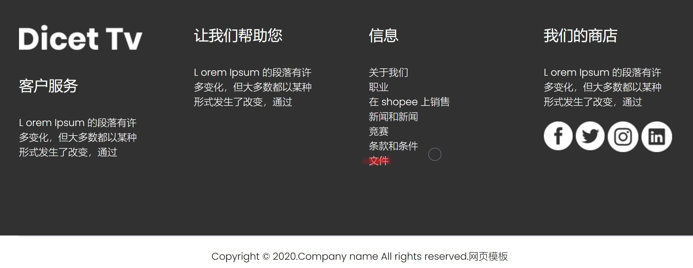

打开后得到一个系统使用手册`/document.pdf`，在其中得到后台登陆地址及用户名密码

打开后台登录，get flag

#### web14

> 默认配置泄露：editor泄露：常用：直接访问example.com/editor，插入处可获知路径

根据题目信息在URL尾部添加`/editor/`访问编辑器

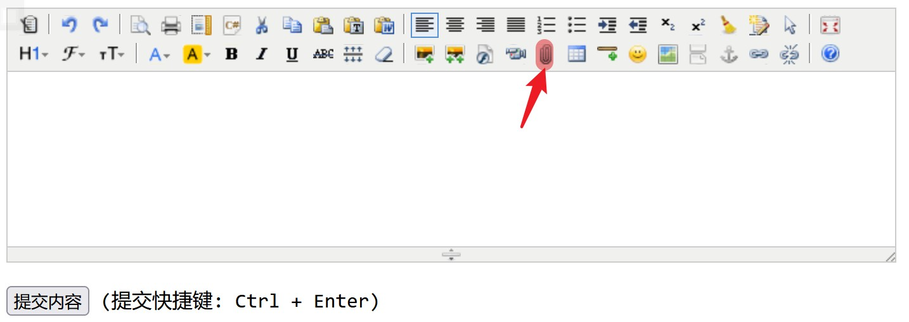

发现一个上传文件选项 打开

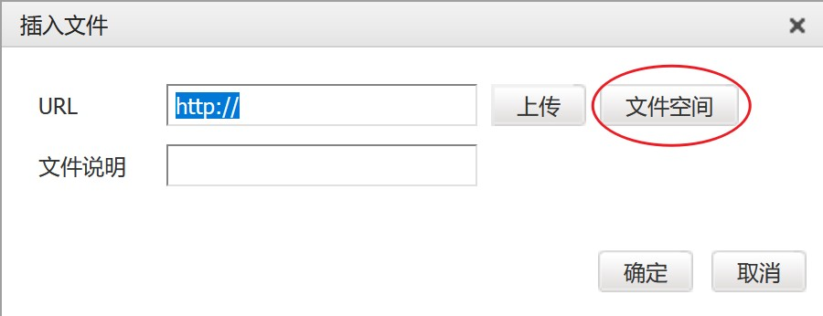

打开文件空间

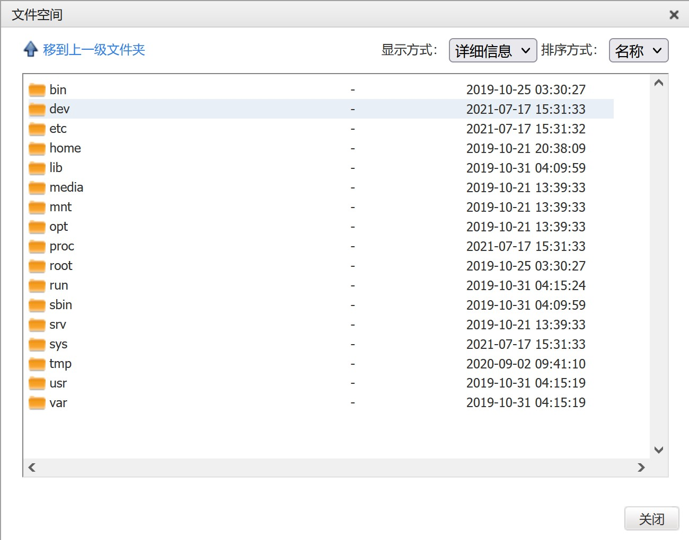

逐个搜索后，在`var/www/html/nothinghere/`中发现**fl000g.txt**文件

最后回到初始界面，在URL尾部添加`/nothinghere/fl000g.txt`打开，得到flag

#### web15

根据题目信息在页面底部发现一个邮箱，肯定要利用到登录

点击页面上方的登录是个空链接

使用dirsearch扫描到一个`/admin/`界面，访问

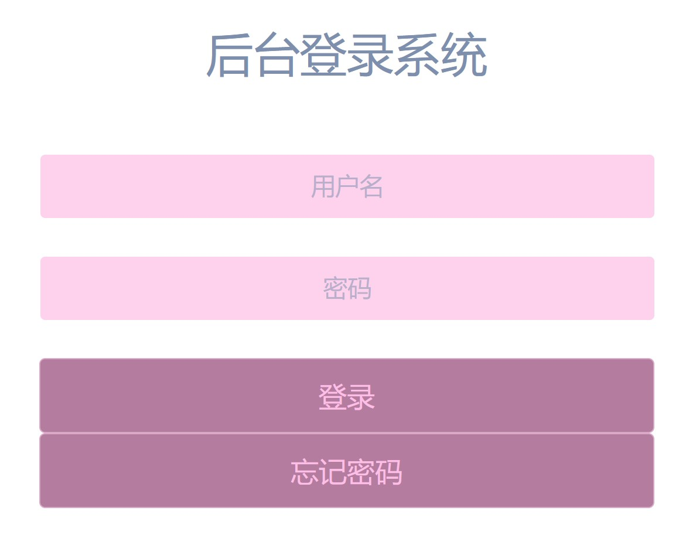

不知道密码，点击忘记密码试试

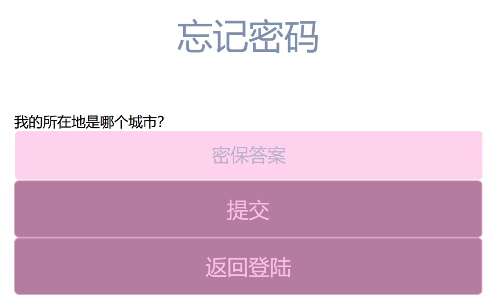

根据QQ邮箱的QQ号查到所在地址为西安

输入西安

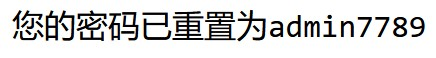

使用`1156631961@qq.com/admin7789`登录显示用户名错误

改用`admin/admin7789`试试

成功拿到flag

#### web16

> php探针是用来探测空间、服务器运行状况和PHP信息用的，探针可以实时查看服务器硬盘资源、内存占用、网卡流量、系统负载、服务器时间等信息

在URL尾部添加`/tz.php`，打开此页面

试了一下，**dirsearch**和**dirmap**扫描目录都没有扫到`/tz.php`

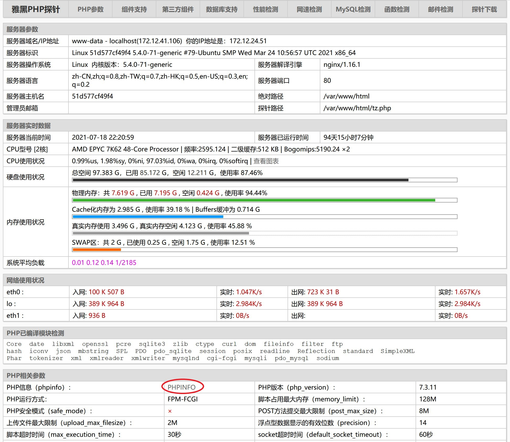

在PHP相关参数中打开PHPINFO界面，搜索flag，get

#### web17

`ping`了一下**ctfer.com**，`ping`不通

原来...

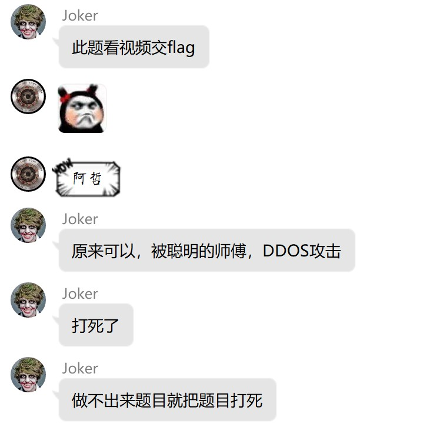

改`ping`一下**ctfshow.com**得到**IP**，即可提交flag

#### web18

打开环境是一个游戏，f12审查元素

打开`/js/Flappy_js.js`审计代码

```javascript
if(score>100)
{
var result=window.confirm("\u4f60\u8d62\u4e86\uff0c\u53bb\u5e7a\u5e7a\u96f6\u70b9\u76ae\u7231\u5403\u76ae\u770b\u770b");
}
else
{
var result=window.confirm("GAMEOVER\n是否从新开始");
if(result){
location.reload();}
}
```

对`\u4f60\u8d62\u4e86\uff0c\u53bb\u5e7a\u5e7a\u96f6\u70b9\u76ae\u7231\u5403\u76ae\u770b\u770b`进行Unicode解码，得到**你赢了，去幺幺零点皮爱吃皮看看**

打开`/110.php`得到flag

#### web19

查看源代码，在下面发现注释的php片段

```php
error_reporting(0);
    $flag="fakeflag"
    $u = $_POST['username'];
    $p = $_POST['pazzword'];
    if(isset($u) && isset($p)){
        if($u==='admin' && $p ==='a599ac85a73384ee3219fa684296eaa62667238d608efa81837030bd1ce1bf04'){
            echo $flag;
        }
}
```

输入用户名密码后登录却显示错误

抓包测试发现`admin/123456`被编码为了`username=admin&pazzword=226d550329a609347c3cc2ec97532645`

打开hackbar，使用post传参，出现flag

#### web20

> mdb文件是早期asp+access构架的数据库文件

没思路，通过hint查看`/db/db.mdb`，下载到本地，查看**db.mdb**文件，搜索flag/ctfhub，get it!

### 爆破

#### web21

## misc入门

### 图片篇（基础操作）

#### misc1

一个简单的图片，通过识别文字获取flag

#### misc2

> [十六进制文件头](https://sheeprooo.top/2021/05/27/CTF%E5%AD%A6%E4%B9%A0%E7%AC%94%E8%AE%B0/#more)

一个**txt**文件 打开之后是乱码，使用winhex查看16进制文件头发现是png格式，修改后缀名

#### misc3

是一个bpg文件，可使用Bandzip附带的Honeyview打开查看，得到flag

#### misc4

一共六个txt文件，使用winhex查看文件头，通过对照[十六进制文件头](https://sheeprooo.top/2021/05/27/CTF%E5%AD%A6%E4%B9%A0%E7%AC%94%E8%AE%B0/#more)中的信息，将其分别修改为``，``，

### 图片篇（信息附加）

#### misc5

## crypto

### 0x00

#### 密码学签到

倒置即可

#### crypto2


# bugku

## web1
...滑稽脸

F12打开源码，找到flag

## web2
是一个填写验证码的输入框，然后发现无法输入两个字符，F12审查元素，果然输入框限制了maxlength，修改maxlength为2即可

## web3
打开场景是一段PHP代码，
```php
$what=$_GET['what'];
echo $what;
if($what=='flag')
echo 'flag{****}';
```
审计，是要通过get的方式提交一个变量`what=flag`，
在地址栏输入`http://114.67.246.176:16477/?what=flag`即可得到flag

## web4
打开场景又是一段PHP代码，
```php
$what=$_POST['what'];
echo $what;
if($what=='flag')
echo 'flag{****}';
```
审计，是要通过post的方式提交一个变量`what=flag`,通过hackbar post一下即可

## web5
打开场景又是一段PHP代码，
```php
$num=$_GET['num'];
if(!is_numeric($num))
{
echo $num;
if($num==1)
echo 'flag{**********}';
}
```
审计，是弱类型比较，要求num变量既不是数字又满足等于1的条件，所以在1后面加一个字母即可
通过get方式提交`http://114.67.246.176:12222/?num=1a`
得到flag

## web6
打开场景一堆弹窗，关都关不完，查看网页源码，

...发现写了一堆alert...绝了
在最下面发现了注释掉的编码，

查了一下是Unicode编码，通过工具Unicode转ASCII得到flag

## web7
弹窗提示停止网页刷新可得到flag
查看网页源代码，发现

并且前面的图片命名为num.jpg，于是尝试刷新，发现图片num确实随着刷新改变，然后不断刷新，最后在一次刷新后圈圈的地方出现flag

## web8
> PHP暂略
## web9

> PHP暂略
## web 10
打开页面显示什么也没有？信个鬼
根据描述头等舱，联想到消息头，BP抓包，在消息头中得到flag


# ctfhub

## 技能树

### web前置技能

#### HTTP协议

##### 请求方式

HTTP/1.1 八种请求方式: GET,POST,HEAD,OPTIONS,PUT,DELETE,TRACE,CONNECT

打开环境提示HTTP方法为GET，使用CTFHUB方法，我会给你flag

bp抓包改包重放，得到flag

##### 302跳转

看了wp才做出来

打开环境，点击got flag后没反应，f12查看新出现了一个302的index.php页面，使用curl工具`-v`参数输出通信的整个过程，得到flag

##### cookie

打开环境提示管理员才能得到flag

使用EditThisCookie查看，有一个名为admin的cookie值为0，修改为1，刷新得到flag

##### 基础认证

打开环境，有个获得flag的click按钮，点一下弹出窗口需要登陆验证，随便输一个`admin/123`，bp抓包

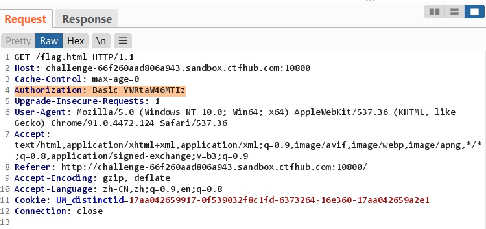

头部有一个Authorization字段，后面的值解码发现是base64加密的`admin:123`

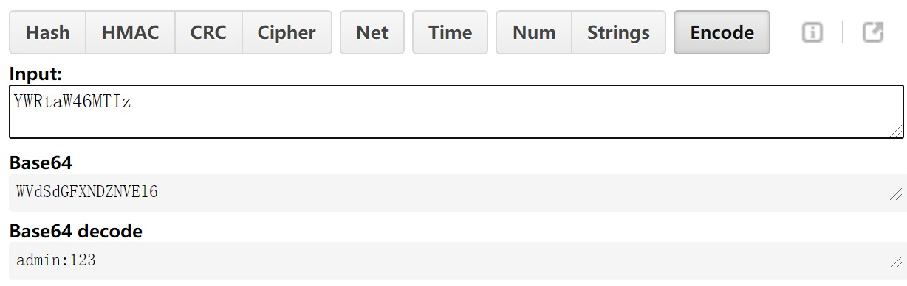

在返回包里发现提示

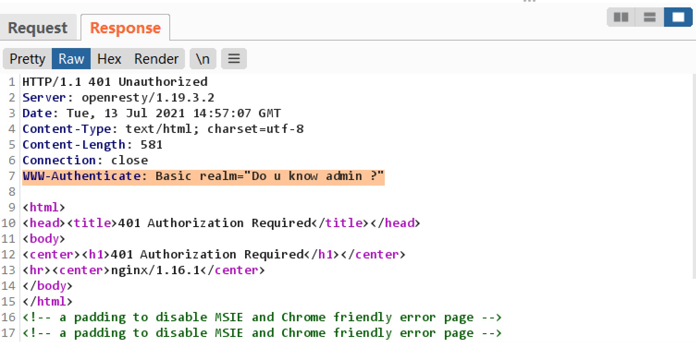

猜测用户名为admin

下面就可以尝试爆破了，发送到Intruder模块，添加payload position

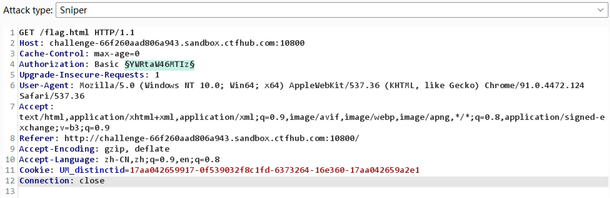

选择模式，加载字典

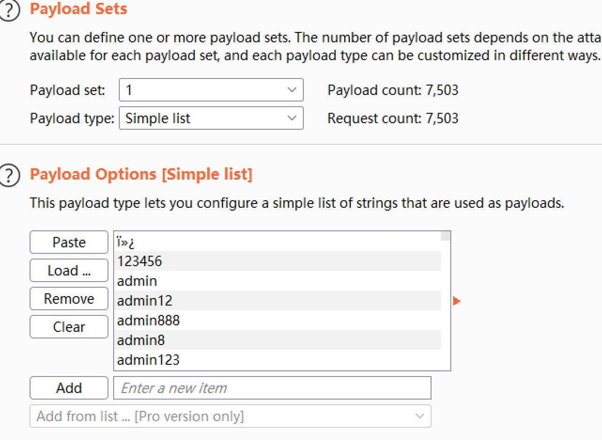

添加前缀`admin:`，并对密码进行base64加密处理（同时取消勾选URL编码，不然你会看到 base64 之后的 `=` 会被转成 `%3d` ，你就算爆破到天荒地老也不会出来）

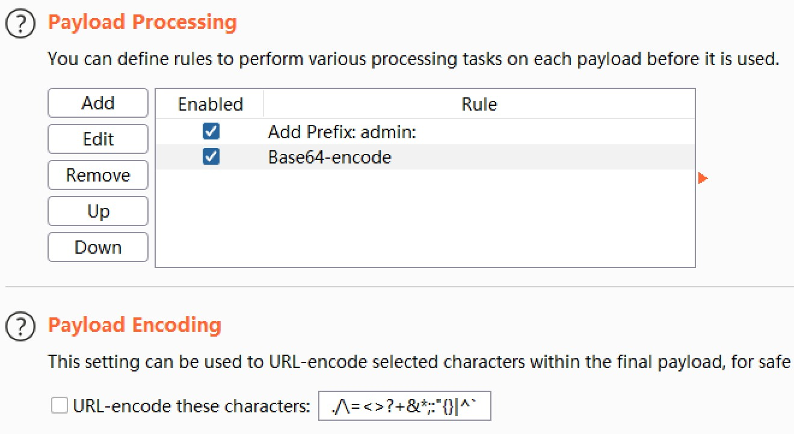

最后在一个状态码为200的响应返回包中发现flag

##### 响应包源代码

饿饿. 打开环境查看源码 发现flag...我人傻了

### 信息泄露

#### 目录遍历

> 目录遍历（路径遍历）是由于web服务器或者web应用程序对用户输入的文件名称的安全性验证不足而导致的一种安全漏洞，使得攻击者通过利用一些特殊字符就可以绕过服务器的安全限制，访问任意的文件（可以是web根目录以外的文件），甚至执行系统命令

打开环境 点击按钮，会跳到这个界面

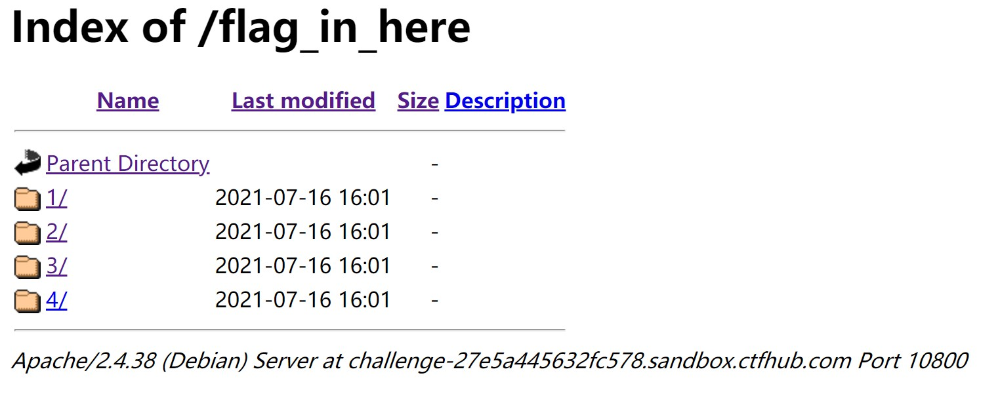

对目录进行地毯式搜索，可找到一个flag.txt文件，打开得到flag

#### phpinfo

> `phpinfo()` 是php中查看相关信息的函数，当在页面中执行`phpinfo()`函数时，php会将自身的所有信息全部打印出来。在phpinfo中会泄露很多服务端的一些信息，例如安装的一些模块、网站绝对路径、服务器自身的操作系统、使用的组件版本等等，在phpinfo中获得的这些信息会为下一步的渗透/做题提供一些帮助

正好之前碰到的一个漏洞就是phpinfo信息泄露，要不然还不了解这个

就是在本题的phpinfo页面中`ctrl+f`，查找ctfhub，然后就找到flag了

#### 备份文件下载

##### 网站源码

> 常见的网站源码备份文件名：`web`，`website`，`backup`，`back`，`www`，`wwwroot`，`temp`
> 常见的网站源码备份文件后缀：`.zip`，`.rar`，`.tar`，`.tar.gz`，`.7z`，`.bak`，`.txt` ，`.old`，`.temp`

试了一下`www.zip`   一发入魂

下载到本地解压发现一个`flag_46657223.txt`文件，但打开没有flag

然后回到环境中，在URL尾部添加`/flag_46657223.txt`打开，得到flag

##### bak文件

> 常见的备份文件后缀名有: `.git`， `.svn`， `.swp`， `.svn` ，`.~` ，`.bak` ，`.bash_history`

打开环境提示flag在index.php的源码里，根据题目信息，在URL尾部添加`/index.php.bak`，下载文件到本地打开 得到flag

##### vim缓存

> 原理同**ctfshow/web入门/信息搜集/web9**

但本题需在URL尾部添加`/.index.php.swp`  （奇了个怪

##### .DS_Store

> `.DS_Store` 是 Mac OS 保存文件夹的自定义属性的隐藏文件，通过`.DS_Store`可以知道这个目录里面所有文件的清单

在URL尾部添加`/.DS_Store`下载到本地打开为乱码，得不到有效信息，使用[github](https://github.com/gehaxelt/Python-dsstore)上的一个工具对DS_Store文件进行解析

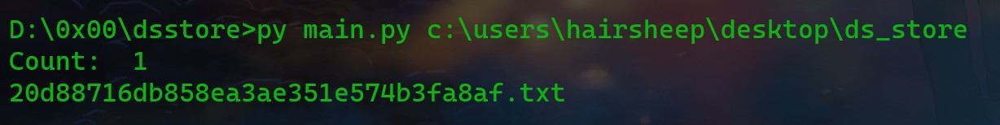

得到一个文件名，在URL尾部添加后读取到flag

#### Git泄露

> 开发人员会使用 git 进行版本控制，对站点自动部署。但如果配置不当，可能会将 .git 文件夹直接部署到线上环境，这就引起了 git 泄露漏洞，我们可以利用这个漏洞直接获得网页源码

##### Log

> `git log`命令可以查看历史版本信息

git泄露肯定要用到githack工具

打开环境用githack克隆一下发现没啥东西？？？

看了wp发现差的不是一点半点啊，

后来才知道现在用的这个工具不行...（被工具背刺 妹想到的

换了个工具克隆，这回没问题了

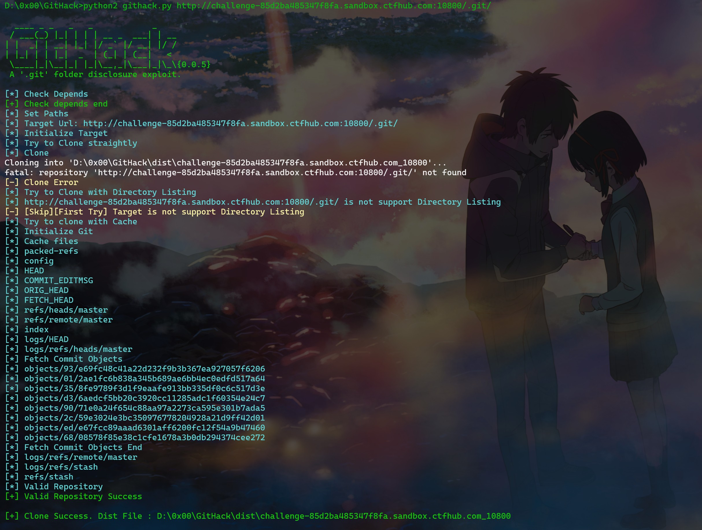

打开克隆的文件夹，根据题目信息，使用`git log`命令查看版本信息

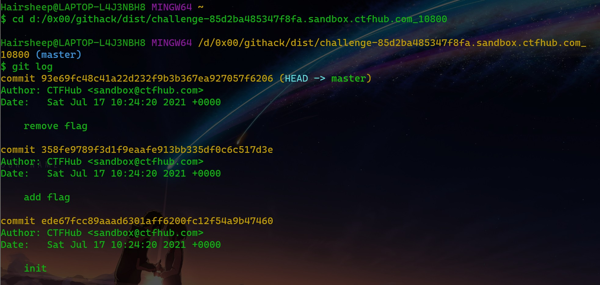

可以看到现在的版本将flag移除，回退到上一个版本即可得到flag

`git reset --hard HEAD^`回退到上一个版本

> 在Git中，用HEAD表示当前版本，
>
> 所以回退到上一个版本就只需要使用命令：`git reset --hard HEAD^ `
>
> 回退到上上个版本则使用命令：`git reset --hard HEAD^^`
>
> 要是需要回退到20个版本之前的话，就可以使用命令：`git reset --hard HEAD~20`

本题还可以使用`git reset --hard 358fe9789f3d1f9eaafe913bb335df0c6c517d3e`来回退

回退后使用`ls`命令查看目录，然后使用`cat`命令查看文件 得到flag

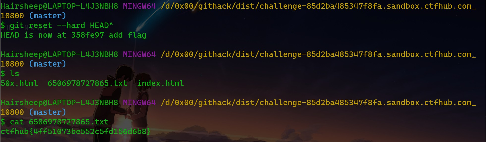

##### Stash

#### SVN泄露

http://www.qishunwang.net/news_show_62103.aspx

https://www.freesion.com/article/98721217183/
