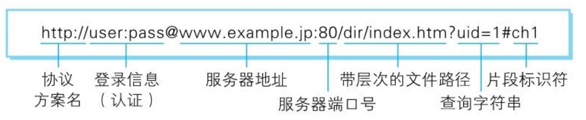

《图解HTTP》学习记录

<!--more-->

## URI和URL

### URI

统一资源标识符（Uniform Resource Identifier，URI)是一个用于标识某一互联网资源名称的字符串。 该种标识允许用户对任何（包括本地和互联网）的资源通过特定的协议进行交互操作。URI由包括确定语法和相关协议的方案所定义

绝对路径格式

> ftp://ftp.is.co.za/rfc/rfc1808.txt   
>
> http://www.ietf.org/rfc/rfc2396.txt    
>
> ldap://[2001:db8::7]/c=GB?objectClass?one    
>
> mailto:John.Doe@example.com    
>
> news:comp.infosystems.www.servers.unix    
>
> tel:+1-816-555-1212    
>
> telnet://192.0.2.16:80/    
>
> urn:oasis:names:specification:docbook:dtd:xml:4.1.2

### URL

