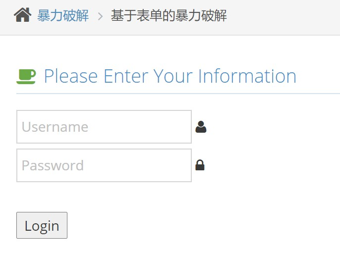
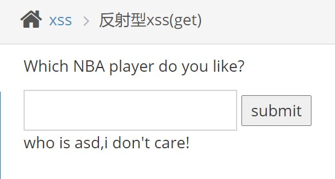
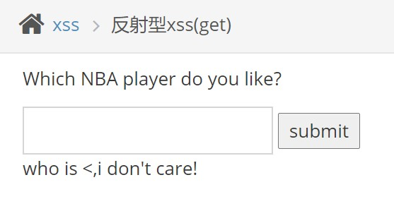
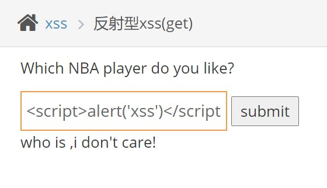
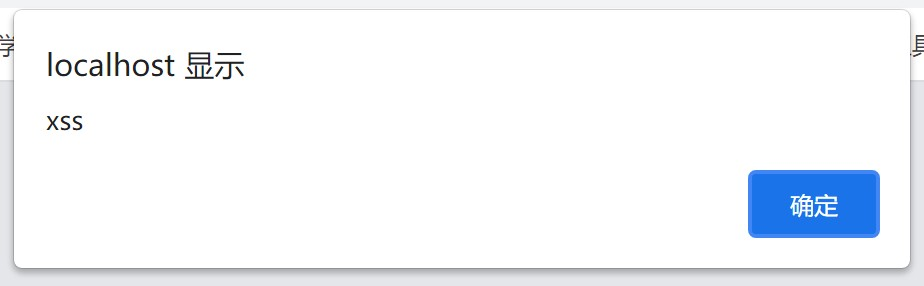
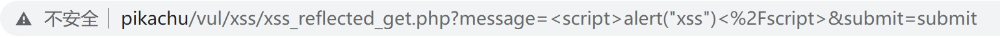
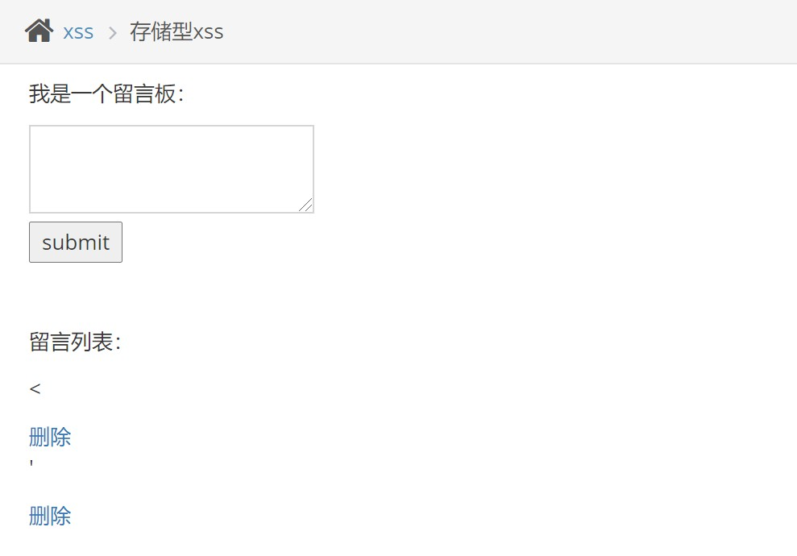
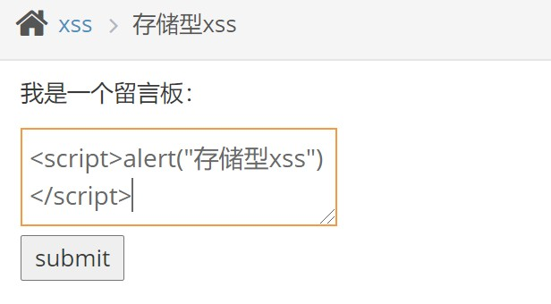
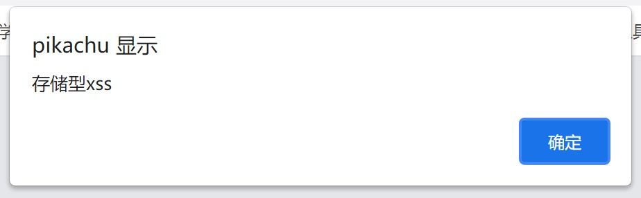

渗透测试靶场练习

<!--more-->

# pikachu靶场

## 爆破练习

### 概述

“暴力破解”是一攻击具手段，在web攻击中，一般会使用这种手段对应用系统的认证信息进行获取。 其过程就是使用大量的认证信息在认证接口进行尝试登录，直到得到正确的结果。 为了提高效率，暴力破解一般会使用带有字典的工具来进行自动化操作

理论上来说，大多数系统都是可以被暴力破解的，只要攻击者有足够强大的计算能力和时间，所以断定一个系统是否存在暴力破解漏洞，其条件也不是绝对的。 我们说一个web应用系统存在暴力破解漏洞，一般是指该web应用系统没有采用或者采用了比较弱的认证安全策略，导致其被暴力破解的“可能性”变的比较高。 这里的认证安全策略, 包括：

1.是否要求用户设置复杂的密码；
2.是否每次认证都使用安全的验证码（想想你买火车票时输的验证码～）或者手机otp；
3.是否对尝试登录的行为进行判断和限制（如：连续5次错误登录，进行账号锁定或IP地址锁定等）；
4.是否采用了双因素认证；
等等...
千万不要小看暴力破解漏洞,往往这种简单粗暴的攻击方式带来的效果是超出预期的

> 从来没有哪个时代的黑客像今天一样热衷于猜解密码 ——奥斯特洛夫斯基

### 基于表单的暴力破解

一个登陆界面的表单，随便试试，然后BP抓包，发送到爆破模块，读字典爆破

(离谱的是Chrome抓不了包，应该是localhost的问题，火狐通过`about:config`修改一下抓取localhost的设定就好了，应该是Chrome的问题)

### 验证码绕过(on server)

### 验证码绕过(on client)

## XSS练习

### 概述

Cross-Site Scripting 简称为“CSS”，为避免与前端叠成样式表的缩写"CSS"冲突，故又称XSS。一般XSS可以分为如下几种常见类型：
  1.反射性XSS;
  2.存储型XSS;
  3.DOM型XSS;

XSS漏洞一直被评估为web漏洞中危害较大的漏洞，在OWASP TOP10的排名中一直属于前三的江湖地位
XSS是一种发生在前端浏览器端的漏洞，所以其危害的对象也是前端用户
形成XSS漏洞的主要原因是程序对输入和输出没有做合适的处理，导致“精心构造”的字符输出在前端时被浏览器当作有效代码解析执行从而产生危害
因此在XSS漏洞的防范上，一般会采用“对输入进行过滤”和“输出进行转义”的方式进行处理:
 输入过滤：对输入进行过滤，不允许可能导致XSS攻击的字符输入;
 输出转义：根据输出点的位置对输出到前端的内容进行适当转义

### 反射型XSS(get)

是一个文本框，随便输一个测试功能正常

输入特殊符号`'` `<`等发现无过滤

尝试输入payload发现文本框限制了字符数

审查元素修改一下`maxlength`

再输入payload:  ``

成功触发XSS

ps: 或者直接在地址栏输入

也可以成功触发XSS

### 反射型XSS(post)

多一步登录的步骤

登陆后文本框同上题

同理输入payload，成功触发XSS

### 存储型XSS

是一个留言板，可以存入数据库，每次打开此页面都会显示之前的留言

并且，经测试，发现输入特殊符号`'` `<`无过滤

输入payload:  ``

成功触发XSS，并且由于留言板写入数据库，每次打开此页面都会触发XSS

# sqli-labs靶场

# DVWA靶场
